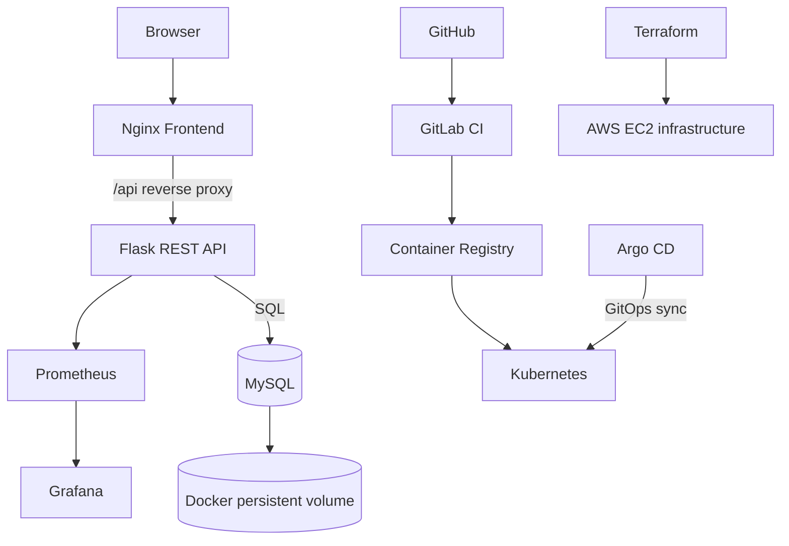

# Architecture

```mermaid
flowchart TD
    U[Browser] --> N[Nginx Frontend]
    N -->|/api reverse proxy| A[Flask REST API]
    A -->|SQL| D[(MySQL)]
    D --> V[(Docker persistent volume)]
    GH[GitHub] --> GL[GitLab CI]
    GL --> R[Container Registry]
    R --> K[Kubernetes]
    AR[Argo CD] -->|GitOps sync| K
    T[Terraform] --> AWS[AWS EC2 infrastructure]
    A --> P[Prometheus]
    P --> G[Grafana]
```
Start locally with Compose; configure and enable cloud CI/CD, Kubernetes, GitOps and monitoring one stage at a time.
